# KolamAI - Complete System Flowchart for SIH Presentation

## Main System Architecture Flow

```mermaid
flowchart TD
    A[🎯 User Access KolamAI Platform] --> B{Choose Feature}

    B --> C[🎨 Create Kolam]
    B --> D[🔍 Analyze Kolam]
    B --> E[🎮 Play Games]
    B --> F[👥 Community Hub]

    %% Create Kolam Flow
    C --> C1[Select Pattern Type<br/>Mandala/Radial/Linear/Geometric]
    C1 --> C2[Configure Parameters<br/>Grid Size, Shapes, Complexity]
    C2 --> C3[Generate Visual Pattern]
    C3 --> C4[Preview & Adjust]
    C4 --> C5[Export/Save Design]

    %% Analyze Kolam Flow
    D --> D1[📤 Upload Kolam Image]
    D1 --> D2[🔄 Image Processing]
    D2 --> D3[🤖 AI Analysis Engine<br/>Gemini 2.5 Flash/Pro]
    D3 --> D4[📊 Generate Analysis Report]
    D4 --> D5[Display Results<br/>Dots, Symmetry, Complexity, Culture]

    %% Games Flow
    E --> E1[🎯 Dot Connector Game]
    E --> E2[🧠 Pattern Memory Game]
    E --> E3[⚖️ Symmetry Master Game]
    E1 --> E4[Track Progress & Scores]
    E2 --> E4
    E3 --> E4

    %% Community Flow
    F --> F1[📋 View Community Feed]
    F --> F2[📤 Share Your Design]
    F --> F3[🏆 Join Challenges]
    F2 --> F4[Upload Image & Details]
    F4 --> F5[Post to Community]
    F3 --> F6[Participate in Contests]

    %% Styling
    classDef createFlow fill:#e1f5fe,stroke:#0277bd,stroke-width:2px
    classDef analyzeFlow fill:#f3e5f5,stroke:#7b1fa2,stroke-width:2px
    classDef gameFlow fill:#e8f5e8,stroke:#2e7d32,stroke-width:2px
    classDef communityFlow fill:#fff3e0,stroke:#f57c00,stroke-width:2px

    class C,C1,C2,C3,C4,C5 createFlow
    class D,D1,D2,D3,D4,D5 analyzeFlow
    class E,E1,E2,E3,E4 gameFlow
    class F,F1,F2,F3,F4,F5,F6 communityFlow
```

## AI Analysis Engine Detailed Flow

```mermaid
flowchart TD
    A[📤 Image Upload] --> B[🔍 Image Validation<br/>Format, Size, Quality Check]
    B --> C{Valid Image?}
    C -->|No| D[❌ Show Error Message]
    C -->|Yes| E[🔄 Convert to Base64]

    E --> F[🤖 Send to Gemini AI]
    F --> G[📋 Enhanced Analysis Prompt<br/>Step-by-step Methodology]

    G --> H[🧠 AI Processing]
    H --> I[📊 Generate JSON Response]

    I --> J[✅ Validate Results<br/>Check Realistic Values]
    J --> K{Results Valid?}

    K -->|No| L[🔄 Try Fallback Model<br/>Gemini Flash → Pro]
    L --> M{Fallback Success?}
    M -->|No| N[⚠️ Show Analysis Error]
    M -->|Yes| O[📈 Display Validated Results]

    K -->|Yes| O

    O --> P[📋 Show Analysis Report<br/>• Dot Analysis<br/>• Symmetry Analysis<br/>• Complexity Score<br/>• Cultural Context<br/>• Mathematical Principles]

    %% Styling
    classDef processFlow fill:#e3f2fd,stroke:#1976d2,stroke-width:2px
    classDef aiFlow fill:#f1f8e9,stroke:#388e3c,stroke-width:2px
    classDef errorFlow fill:#ffebee,stroke:#d32f2f,stroke-width:2px
    classDef resultFlow fill:#e8f5e8,stroke:#2e7d32,stroke-width:2px

    class A,B,E processFlow
    class F,G,H,I aiFlow
    class D,N errorFlow
    class J,L,O,P resultFlow
```

## Technology Stack & Architecture

```mermaid
flowchart LR
    subgraph "Frontend Layer"
        A[⚛️ React + TypeScript]
        B[🎨 Tailwind CSS]
        C[🧩 Shadcn/ui Components]
        D[📱 Responsive Design]
    end

    subgraph "Backend Services"
        E[🚀 Vercel Serverless Functions]
        F[🖥️ Express.js Development Server]
        G[📤 File Upload Processing]
        H[🔄 Image Processing]
    end

    subgraph "AI Integration"
        I[🤖 Google Gemini 2.5 Flash]
        J[🧠 Google Gemini 2.5 Pro]
        K[📊 Advanced Prompt Engineering]
        L[✅ Result Validation]
    end

    subgraph "Features"
        M[🎨 Pattern Generation]
        N[🔍 Image Analysis]
        O[🎮 Interactive Games]
        P[👥 Community Platform]
    end

    A --> E
    B --> A
    C --> A
    D --> A

    E --> I
    F --> J
    G --> H
    H --> K

    I --> L
    J --> L
    K --> L

    L --> M
    L --> N
    A --> O
    A --> P

    %% Styling
    classDef frontend fill:#e1f5fe,stroke:#0277bd,stroke-width:2px
    classDef backend fill:#f3e5f5,stroke:#7b1fa2,stroke-width:2px
    classDef ai fill:#e8f5e8,stroke:#2e7d32,stroke-width:2px
    classDef features fill:#fff3e0,stroke:#f57c00,stroke-width:2px

    class A,B,C,D frontend
    class E,F,G,H backend
    class I,J,K,L ai
    class M,N,O,P features
```

## User Journey Flow

## Data Flow Architecture

```mermaid
flowchart TD
    subgraph "User Interface"
        A[🖥️ Web Browser]
        B[📱 Mobile Interface]
    end

    subgraph "Application Layer"
        C[⚛️ React Frontend]
        D[🔄 State Management]
        E[📡 API Calls]
    end

    subgraph "API Gateway"
        F[🚀 Vercel Functions]
        G[🛡️ CORS Handling]
        H[📤 File Upload]
    end

    subgraph "AI Services"
        I[🤖 Gemini API]
        J[🔍 Image Analysis]
        K[📊 Result Processing]
    end

    subgraph "Data Storage"
        L[💾 Local Storage<br/>User Preferences]
        M[☁️ Session Storage<br/>Temporary Data]
        N[📁 Static Assets<br/>Images, Patterns]
    end

    A --> C
    B --> C
    C --> D
    D --> E
    E --> F
    F --> G
    G --> H
    H --> I
    I --> J
    J --> K
    K --> F
    F --> E
    E --> D
    D --> L
    D --> M
    C --> N

    %% Styling
    classDef ui fill:#e1f5fe,stroke:#0277bd,stroke-width:2px
    classDef app fill:#f3e5f5,stroke:#7b1fa2,stroke-width:2px
    classDef api fill:#e8f5e8,stroke:#2e7d32,stroke-width:2px
    classDef ai fill:#fff3e0,stroke:#f57c00,stroke-width:2px
    classDef storage fill:#fce4ec,stroke:#c2185b,stroke-width:2px

    class A,B ui
    class C,D,E app
    class F,G,H api
    class I,J,K ai
    class L,M,N storage
```

---

## How to Use This Flowchart in Your PPT:

1. **Copy the Mermaid code** from any section above
2. **Visit**: https://mermaid.live/ or use Mermaid plugins
3. **Paste the code** to generate the flowchart
4. **Export as PNG/SVG** for high-quality images
5. **Insert into your PowerPoint** presentation

## Recommended Slides Structure:

1. **Slide 1**: Main System Architecture Flow
2. **Slide 2**: AI Analysis Engine Detailed Flow
3. **Slide 3**: Technology Stack & Architecture
4. **Slide 4**: User Journey Flow
5. **Slide 5**: Data Flow Architecture

Each flowchart highlights different aspects of your KolamAI project for comprehensive presentation coverage.
